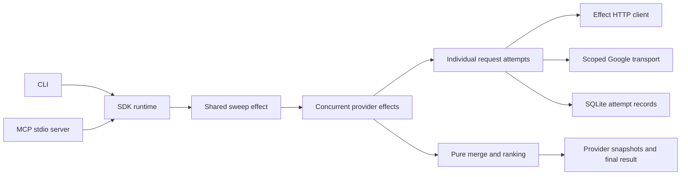

# Wideband architecture

Wideband runs one query across search providers and returns deduplicated sources with provenance, rank fusion, and request accounting. Effect 4 owns provider I/O, concurrency, cancellation, and resource lifetimes. Pure functions own URL canonicalization, merging, ranking, freshness classification, and cost arithmetic.

The [migration report](effect-4-plan.md) records the motivating defects. This document describes the implemented 0.4 architecture.

## Domain vocabulary

- A **provider** is an external search service. Its adapter translates queries and validates responses.
- A **sweep** is one shared query execution. Its `sweepId` identifies the execution even when several callers share it.
- A **request** is one logical provider operation, such as page 2 of an AnyAPI search.
- An **attempt** is one dispatch of that request. A retry creates another attempt and budget reservation.
- A **hit** is one normalized provider result. A **source** merges hits with the same canonical URL and retains their provenance.
- A **charge** is observed, estimated, or unknown. Unknown charges retain the reserved estimate.
- The **ledger** stores sweeps, provider outcomes, attempts, cached results, and session claims.

## Runtime ownership

`src/index.ts` creates one lazy `ManagedRuntime` per `wideband()` client. A scoped layer acquires the internal Ledger, creates the Engine, and supplies the Effect HTTP client. Closing interrupts active work, awaits finalizers, and closes SQLite. Subsequent calls fail with `CLOSED`.

The SDK exposes Promise methods and an asynchronous event iterator. Core operations return Effects. The standalone Google module exports Effects and Promise convenience functions. Only those convenience boundaries start a runtime.

## Files and responsibilities

- `src/core/types.ts` defines Effect Schemas, adapter contracts, request receipts, charges, and events.
- `src/core/errors.ts` defines `AdapterError`, `LedgerError`, `WidebandError`, and safe error messages.
- `src/core/engine.ts` owns provider selection, deadlines, request policy, shared execution, result assembly, and per-caller session projection.
- `src/core/ledger.ts` owns synchronous Bun SQLite operations and schema migration. The engine maps failures into typed storage errors.
- `src/core/merge.ts`, `freshness.ts`, and `cost.ts` contain pure domain operations.
- `src/adapters/http.ts` reads responses, extracts reported cost independently, and validates the response schema.
- `src/adapters/*.ts` define provider capabilities, estimates, request parameters, and normalization.
- `src/google-search.mjs` owns Google HTML parsing, proxy reservations, and the subprocess transport.
- `src/cli/main.ts` and `src/mcp/main.ts` adapt the SDK to their wire protocols.

## Provider outcomes and request policy

An adapter's `search(query, context)` returns an Effect and submits each request through `context.request`. After a page succeeds, `context.addHits` contributes its hits. A later failure cannot erase them.

`RequestReceipt` pairs a typed result with an optional reported amount. A valid charge survives an invalid result envelope. Required URLs, result envelopes, and numeric fields are validated. Optional descriptive metadata may be absent or null. Raw row fields are retained for `capture`.

The engine handles recoverable `AdapterError` values independently for each provider. Defects, caller interruption, and storage failures remain distinct. An `ok` provider may return zero hits. A `partial` provider retains useful hits after a later failure, producing `complete: false`. If no provider completed successfully and no partial provider retained useful hits, the SDK rejects with the collected result attached. The CLI preserves result output and exit code 5.

`timeoutMs` is a provider deadline, including queue waits, pages, retry delays, and active transport. The caller's signal cancels its operation. Cancelling one subscriber preserves work needed by other subscribers.

A semaphore permits one active request per provider within an Engine. Genuine rate limits update shared pacing from `Retry-After`. Quota and authentication errors neither retry nor update rate-limit pacing.

Rate-limit and transient server responses may retry once. A lost response leaves uncertain billing and does not automatically repeat potentially charged work. Google keeps its bounded proxy fallback within a zero-search-fee page and disables an additional engine retry.

## Budget and persistence

Before dispatch, the engine checks a shared sweep budget in integer microdollars and inserts a pending attempt. A failed insert prevents network work. Protected finalization records observed or estimated usage, or retains the reservation as unknown after interruption or transport loss.

Reported amounts replace reservations. Estimates account for actual page dispatches, result surcharges, research depth, and AnyAPI's automatic-fallback bound. This limits modeled exposure. It cannot undo charges or guarantee that a provider never bills above its published or modeled price.

`cost.totalUSD` includes observed amounts, ordinary estimates, and estimates for unresolved attempts. Provider costs also expose `observedUSD`, `estimatedUSD`, `unknownAttempts`, and `attempts`. A failed summary cannot erase prior attempt records. Failed attempt finalization exposes the last known charge through `LedgerError`, while the durable pending row remains uncertain.

Tables are `sweeps`, `calls`, `attempts`, `cache`, and `seen`. Migration preserves existing data. `accounting_version` distinguishes historical provider summaries from attempt records. Historical monthly `attempts` remain approximate because old rows did not retain retries and pages. Provider statistics retain `calls` as settled provider operations.

## Shared execution and sessions

Effect Cache shares in-flight sweeps with zero retention after settlement. It does not evict pending entries, so a burst cannot start a duplicate execution for an active query. SQLite retains complete successful results, including valid empty searches. Partial, failed, cancelled, and budget-truncated results do not enter the success cache.

The execution key includes normalized query, provider set, credential hashes, capture mode, budget, effective deadlines, TTL option, and sweep kind. Raw credentials never enter the key. `fresh` bypasses persistent lookup and shared execution.

Each execution retains provider completion events for late subscribers. Events contain cumulative source snapshots. Each caller receives copies, so consumer mutation cannot corrupt shared results.

Sessions are excluded from retrieval identity. A stream filters against its caller's previously seen sources. Final delivery claims source IDs atomically in SQLite. Concurrent callers in one session cannot both claim a source, while different sessions can share retrieval.

## Schemas and entrypoints

Effect Schemas define query, source, sweep, and tool contracts. Wire schemas use finite bounds, `optionalKey`, and `withDecodingDefaultKey`. Parse helpers treat explicit undefined object properties as omissions for SDK callers. Null and invalid array elements remain invalid.

The CLI adds `--stream` NDJSON without changing the meanings of result limits, pagination, freshness, or provider deadlines. Normal output remains JSON or pretty text, with diagnostics on stderr.

The custom MCP boundary generates shared tool schemas, negotiates protocols, handles cancellation, and awaits accepted work after EOF. SIGTERM cancels requests and waits for cleanup. The bundled Effect MCP implementation was evaluated; retaining the small boundary avoided additional capabilities and protocol coupling.

## Google process and proxy ownership

Google uses `uv` and pinned `curl_cffi` in a detached process group. Its Effect callback finalizer kills the group and waits for close. The standalone module runs on Node 22.16 or newer without Bun-specific imports.

Proxy reservations stay in `~/.wideband/google-proxies.sqlite`. Immediate transactions coordinate separate processes, with three minutes between uses, a two-hour penalty after a block, and a fifteen-minute penalty after another failure. A page waits up to 45 seconds for a free proxy and fails as unavailable when none will be free within that time. The store contains hashes and timestamps. Each page retains its 45-second deadline and at most three proxy attempts. A failed page records `google:<reason>` as the attempt's ledger error code, where the reason is the SearchError code or the ordered list of failed proxy attempts.

## Verification

`bun run test` exercises SDK and CLI searches against local HTTP, checks actual SQLite records, and drives MCP over stdio. It covers normalization, partial results, budgets, retries, schemas, caching, sessions, streaming, cancellation, storage failures, and shutdown without paid provider calls.

`bun run typecheck` checks source and in-repo consumers. `bun run build` produces package entrypoints and declarations. `testing/google-live.ts` uses configured Google proxies and providers. Live quota or authorization failures do not establish successful provider normalization.
