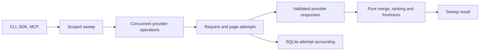

# Effect 4 migration report and plan

Research date: October 2, 2026. Code examined: `1e55de1`. Runtime used for the experiments: Bun 1.4.0 and Effect 4.0.0.

This document records the investigation and migration plan at `1e55de1`. The 0.4 implementation is described in [architecture.md](architecture.md), with public changes in [handoff.md](handoff.md). Findings and source line references below describe the pre-migration code. Ongoing execution details are in [implementation-notes.html](implementation-notes.html).

Adopt Effect throughout provider I/O and search orchestration. Make each potentially billable request the unit of retries, budget reservation, and accounting. Keep URL canonicalization, merging, ranking, freshness decisions, and cost calculations as pure functions.

Start with a complete AnyAPI path through the CLI. Its pagination and reported request costs expose the most consequential problems in the current execution model.

## Why the migration is useful

Wideband already has useful domain concepts: queries, providers, hits, sources, provenance, and sweep results. Effect can give the operations around those values a shared model for failure, concurrency, dependencies, and resource ownership.

Wrapping `Engine.sweep` in an Effect would retain the current retry and accounting behavior. Converting every pure helper would add Effect syntax without improving its behavior. The proposed boundary covers provider requests through sweep execution, with Promise conversion at the SDK boundary.

The expected benefits are more accurate spending, cancellation that reaches active work, fewer repeated requests, and earlier access to results. The investigation did not establish a throughput or total-latency improvement for a migrated wideband.

## Effect 4 release facts

The npm registry reported `effect@4.0.0` and `@effect/platform-bun@4.0.0` as the current stable releases during the investigation. The official release describes a rewritten runtime and a core package with no runtime dependencies. Those claims concern Effect itself, not measured performance improvements over wideband's existing Promise code. [Effect 4 announcement](https://effect.website/blog/releases/effect/40).

V4 consolidates HTTP, CLI, SQL, MCP-related AI modules, and other functionality into `effect`. Separate platform and driver packages use matching versions. APIs marked `@stability unstable` can change in minor releases, and experimental APIs can change in patch releases. Start with exact matching versions and keep those integrations behind the existing transport and entrypoint boundaries. [V4 migration guide](https://github.com/Effect-TS/effect/blob/effect%404.0.0/MIGRATION.md).

Use the released v4 APIs when implementing the plan. Examples from the beta period can be stale. Service definitions use `Context.Service`, recoverable outcomes can use `Effect.result`, and HTTP imports use `effect/http`. [Service migration guide](https://github.com/Effect-TS/effect/blob/effect%404.0.0/migration/services.md).

## Reproduced findings

The first five findings came from temporary manual harnesses using the current Engine and adapters. HTTP cases used a controlled local server. These observations establish behavior under the stated inputs, not provider billing behavior in production.

1. **Pagination can exceed the requested budget.** With AnyAPI's modeled price of $0.0004 per request, a $0.0004 sweep budget admitted a two-page search. The completed result reported $0.0008. `applyBudget` estimates one request per provider, while the adapter can issue several. [Budget selection](../src/core/engine.ts#L298), [AnyAPI pagination](../src/adapters/anyapi.ts#L19).

2. **A retry repeats successful pages and loses their cost.** The fixture succeeded on page 1, failed once on page 2, and then succeeded. Requests arrived as `1, 2, 1, 2`. Successful replies reported $0.0012 in total, while the sweep recorded $0.0008. The engine retries the entire adapter operation, whose local cost accumulator starts over. Charges for the failed request were outside this fixture. [Retry loop](../src/core/engine.ts#L319).

3. **Malformed responses can become successful empty searches.** A valid JSON object with the wrong structure produced provider status `ok`, zero sources, and zero recorded cost through AnyAPI. The HTTP helper casts parsed JSON to a generic type, and the adapter defaults missing results to an empty list. A separate auth-failure probe showed that a sweep where every provider failed was cached and returned on the next identical query. [HTTP decoding](../src/adapters/http.ts#L38), [Cache writes](../src/core/engine.ts#L263).

4. **Concurrent identical sweeps duplicate provider work.** Two simultaneous calls through the same Engine and ledger executed the delayed fixture provider twice. Both calls read the cache before either stored its result. [Cache lookup and dispatch](../src/core/engine.ts#L168).

5. **The timeout depends on adapter cooperation.** A fixture adapter observed its abort signal but continued working. A 10 ms timeout returned an `ok` result after approximately 86 ms. The engine signals cancellation and continues awaiting the adapter. This does not establish that the built-in HTTP adapters ignore cancellation. [Adapter deadline](../src/core/engine.ts#L319).

6. **One slow provider delays the complete response.** The real discovery query used for this investigation took 47.728 seconds. Exa completed in 582 ms, Brave in 617 ms, and Google in 2.396 seconds. AnyAPI completed in 47.720 seconds. This single observation supports testing progressive delivery. It is not a latency benchmark or a general ranking of providers.

Google already implements safeguards that the migration must preserve. Its SQLite transaction reserves proxies across processes, with six seconds between uses and a fifteen-minute penalty after a failed attempt. Cancellation kills the detached transport process group on macOS and Linux. An in-memory Effect limiter cannot replace that cross-process coordination. [Google transport and reservations](../src/google-search.mjs#L95).

## Proposed execution model

A sweep is a scoped computation with a typed success value, typed failures, and explicit service requirements. Its conceptual type is `Effect<SweepResult, SweepError, Providers | Ledger>`. The names describe the proposed interface, not an existing export.

### Sweep ownership and provider outcomes

The sweep selects eligible providers and gathers their outcomes. Each provider operation owns its pages and runs inside the sweep's lifetime. Preserve the current meaning of `timeoutMs` as a provider deadline, including retries and waits. A caller abort cancels all provider operations in that sweep.

Collect recoverable provider errors inside concurrent execution. `Effect.result` around each provider operation lets healthy providers finish when another fails. Ordinary concurrent `Effect.all` fails on the first error and can interrupt its siblings. Interruption and programming defects must remain distinct from recoverable provider failures. [Effect result and concurrency behavior](https://github.com/Effect-TS/effect/blob/effect%404.0.0/packages/effect/src/Effect.ts).

Retain the useful existing error categories and distinguish transport failures from invalid provider responses. Give rate-limit errors the information required to honor a retry delay. Map internal errors to the CLI and SDK contracts at their boundaries.

If every attempted provider fails, return an explicit sweep failure. A provider that successfully returns zero hits is a valid empty result. A provider that loses a later page must retain its usage and expose its incomplete outcome.

### Request ownership and accounting

Each potentially billable attempt follows this order:

1. Reserve its allowed cost before dispatch.
2. Apply the provider's pacing and the remaining deadline.
3. Send the request and decode the response.
4. Record reported cost, estimated cost, or an unknown billing outcome.
5. Retry only that request when its error and billing policy permit another attempt.

Use integer microdollars for internal reservations. Share the reservation state across concurrent providers within a sweep. A retry requires another reservation, and a completed page's accounting survives a later failure.

Extend the existing SQLite ledger to retain attempt records as well as sweep summaries. Record attempted work independently of successful hit production. Aggregate spending from those records, so cancellation or an incomplete provider result cannot erase earlier charges.

Cancellation cannot undo a request that reached the provider. A timeout or connection loss can leave its billed amount unknown. A strict cap on actual charges requires a known upper bound for each request. Keep unknown charges visible and avoid presenting them as zero. Storage failures must remain visible to the caller.

Keep one owner for retries. Automatic HTTP retries and adapter-level retries must not create uncounted nested attempts.

### Services and resource lifetimes

Use services for resources and shared policy, principally the HTTP client, ledger, credentials, and Google transport. Keep provider metadata in the registry. Pure helpers need no service classes.

Create one `ManagedRuntime` per SDK client or long-running MCP process. Let its layers own shared resources. Searches own their request scopes. The SDK can expose ordinary Promise methods by running effects at that boundary. Core operations compose effects without starting independent runtimes.

Shutdown stops new work, cancels or finishes active searches, waits for cleanup, and then disposes resources. The Google integration must await process exit as part of cleanup. Passing an abort signal into a Promise wrapper alone does not prove that a subprocess has exited.

Keep the existing Bun SQLite implementation behind a service initially. Effect does not make its synchronous queries nonblocking. Preserve the standalone Google export's Node compatibility and its durable proxy reservations.

### Schemas and public contracts

Decode provider JSON before normalization. Derive query types and MCP JSON Schema from the same boundary definitions. Maintain finite numeric constraints, integer bounds, optional-property behavior, and query defaults explicitly.

Schema migration is an API change. The SDK exports concrete Zod schemas, Engine, Ledger, and `ProviderAdapter`. `close`, `providers`, `stats`, and `costs` also have existing lifecycle or synchronous behavior that callers may depend on. Preserve the ordinary search methods and document changes to these exported contracts in the versioned release. [SDK exports](../src/index.ts).

Migrate affected consumers together and remove obsolete internal interfaces. Remove Zod only after its remaining uses, including the standalone Google module, have migrated. Preserve secret redaction when replacing error handling.

### Caching and shared work

Use Effect's cache to share in-flight work within one runtime. Retain SQLite for persistent caching across CLI processes. The in-memory cache does not coordinate independent processes.

Cache complete successful searches, including valid empty results. Give typed failures zero retention and prevent partial or all-provider-failure results from entering the success cache. Effect caches failures by default, so a direct replacement would preserve an important failure mode. [Effect Cache behavior](https://github.com/Effect-TS/effect/blob/effect%404.0.0/packages/effect/src/Cache.ts).

Coalesce only compatible requests. Account for the normalized query, provider set, capture mode, credential context, and relevant execution limits. Preserve `fresh` behavior. Apply session filtering per caller after shared retrieval, and record shared execution costs once.

## What the Effect experiments established

Temporary prototypes exercised the released Effect 4.0.0 package with real local HTTP requests and SQLite. The Effect prototypes also passed TypeScript checking.

- Concurrent provider calls produced a success, an HTTP failure, and a timeout without losing the successful result.
- A 45 ms deadline around a retrying operation allowed two attempts and returned a timeout after approximately 48 ms.
- Parent cancellation aborted both active HTTP requests and ran the finalizer once.
- Two simultaneous cache lookups executed the loader once. Cancelling one waiting caller preserved the other caller's result.
- Default caching retained a typed failure. Setting its retention to zero caused the next call to retry the loader.
- Schema decoding rejected malformed provider data. A finite integer schema rejected NaN, infinity, fractions, zero, and 101, while generating an integer range of 1 through 100.
- Two concurrent runtime calls shared one SQLite acquisition and produced one release on disposal.
- Retrying each page independently produced requests `1, 2, 2`. Successful-response costs and recorded costs both totaled $0.0008.
- Atomic budget reservations admitted two of four concurrent 400-microdollar attempts against an 800-microdollar budget.
- `Effect.result` preserved a programming defect as a failed effect instead of converting it into a normal provider outcome.

These experiments support the proposed mechanisms. They do not establish a migrated CLI, MCP compatibility, remote billing accuracy, or Google subprocess cleanup under Effect. Their observed inputs and outcomes are recorded here because the original harnesses reside in temporary storage.

## Implementation sequence

### 1. Convert the complete AnyAPI path

Work in `src/adapters/anyapi.ts`, `src/adapters/http.ts`, `src/core/engine.ts`, `src/core/errors.ts`, and `src/core/ledger.ts`, with the necessary entrypoint wiring. Add matching Effect dependencies, define the request and error contracts, and run the adapter through Effect from the CLI. Keep the initial change focused on pagination, deadlines, and accounting.

Use a manual local HTTP harness to demonstrate:

- A failure on page 2 retries page 2 without repeating page 1.
- Completed-page usage survives a later failure or cancellation.
- Concurrent requests cannot reserve more than the sweep budget.
- Wrong-shaped JSON becomes an invalid-response error.
- Caller cancellation reaches the active HTTP request.
- A provider deadline covers pages, retries, and waits.

The implementer uses these results to retain or revise the request boundary before converting the remaining adapters. Correct a failed behavior in this path rather than duplicating it across providers.

### 2. Convert the remaining adapters and sweep

Move provider I/O and orchestration to Effect. Keep normalization and merge algorithms pure. Replace the manual retry loop, timers, and duplicated exception conversion as callers migrate. Make concurrency explicit so the port does not accidentally serialize provider requests.

Verify a mixed sweep with successful, failing, and delayed providers. Check source IDs, provenance, ranking, freshness, provider selection, `max`, and session behavior through the CLI and SDK. Check valid empty results separately from total provider failure.

For Google, exercise process-group cancellation and proxy pacing across separate processes. Preserve its transport-specific limits and the standalone parser export.

### 3. Finish schemas, resource ownership, and entrypoints

Move SDK, CLI, and MCP lifecycle management to scoped execution. Replace duplicated boundary schemas and hand-maintained MCP schema definitions. Update exported types and lifecycle methods deliberately, then migrate their callers and document the public changes.

Evaluate the bundled Effect MCP server as the replacement for the custom stdio handler. It provides stdio transport and cancellation handling, but its API is marked unstable. Verify supported protocol versions, tool inputs, result envelopes, cancellation, and clean shutdown before replacing the handler. [Effect MCP server](https://github.com/Effect-TS/effect/blob/effect%404.0.0/packages/effect/src/ai/McpServer.ts).

Exercise CLI, SDK, and MCP entrypoints against the same fixture responses. Check schema output, error serialization, secret redaction, concurrent requests, EOF, termination signals, and resource release. Update the architecture and adapter documentation to describe the implementation that ships.

### 4. Add progressive results and shared requests

Add an optional streaming interface that emits provider completion events followed by the final merged result. Early sources need stable IDs and update semantics because later providers can change their score, content, and provenance.

Implement request coalescing and explicit cache retention. Add provider throttling shared by searches within a runtime, with durable coordination where separate processes share a constrained resource.

Verify that early results arrive before a deliberately slow provider finishes. The final streamed result must match the batch result under the same policy. Verify cancellation while sharing a request, one accounting record per shared execution, session isolation, and cache behavior after partial failure.

## Scope and tradeoffs

The core migration includes provider I/O, request accounting, error handling, cancellation, resource ownership, and boundary schemas. Streaming and coalescing follow once that path works.

Effect adds a runtime model and a learning cost. Its value depends on deleting the corresponding manual machinery as the migration proceeds. Isolating unstable integrations limits the cost of future library updates.

Adaptive provider selection is a later opportunity. Choosing providers by marginal unique sources per dollar requires measurements that account for query type and provider overlap. The current investigation does not justify a new routing policy or an early-stop threshold.

Use existing configuration for the migration. Any new configuration setting requires user approval. Verification uses end-to-end checks and manual harnesses, with live provider calls only where local fixtures cannot establish integration behavior. Do not add unit tests or a separate workflow framework.

The first implementation deliverable is an AnyAPI CLI search whose retries repeat only the failed request and whose accounting retains every observed charge.
